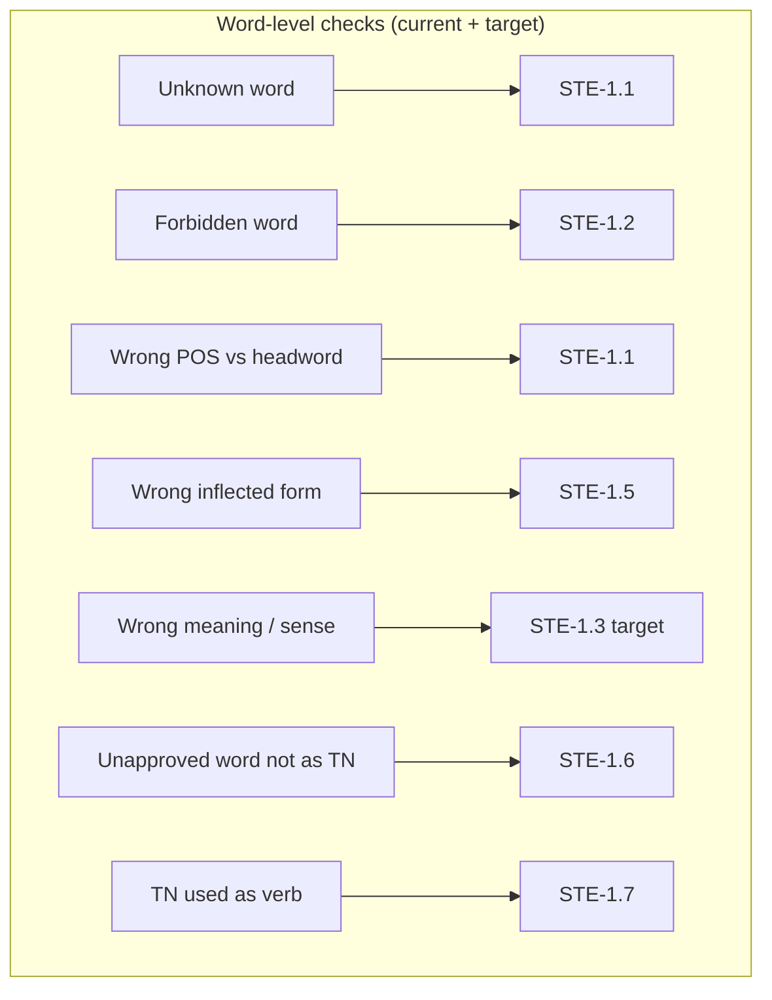
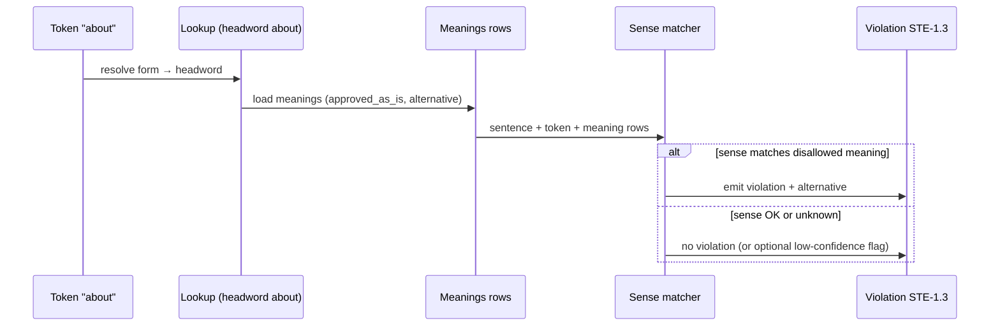

# Missing Dictionary-Driven Word Rules: STE-1.6 & STE-1.7

**Purpose:** This document captures everything needed to implement **dictionary-driven “approved meaning” / sense checking** (aligned with **ASD-STE100 Rule 1.3** in Issue 9) and related **conditional** dictionary semantics, so ADAM’s word-level checking matches the ASD-STE dictionary’s *meaning rows* (Excel D/E)—not only “approved vs not approved” and “allowed forms” (STE-1.1, STE-1.2, STE-1.5).

**Important (Issue 9 numbering):** In **ASD-STE100 Issue 9**, **Rule 1.3** is *“Use approved words only with their approved meanings”* (dictionary meanings / alternatives). **Rules 1.6 and 1.7** are **different**: they govern **technical nouns** and **unapproved words** (see §2). This file keeps the checklist id **“STE-1.6 / STE-1.7”** as originally planned for *implementation milestones*; where the thesis must cite the standard, cite **Rule 1.3** for meaning/sense compliance and **Rules 1.6–1.7** only for the technical-noun rules quoted below.

**Status today:** STE-1.6 and STE-1.7 are **not implemented** in the analysis pipeline. The dictionary **already stores** meaning rows (`ste_meanings`) from ASD-STE_Word.xlsx, but `ste11-engine.ts` does **not** use them to decide when an approved word is used in a **disallowed meaning**.

**Primary references:** `adam_dictionary_spec.md`, `docs/ASD-STE_Word-xlsx-analysis.md`, ASD-STE100 Issue 9 (official rule text—must be cited verbatim in the thesis), `prisma/schema.prisma`, `app/lib/analysis/ste11-engine.ts`, `scripts/seed-dictionary.ts`.

---

## 1. Why This Gap Matters for the Thesis

| Claim | Without STE-1.6 / 1.7 | With STE-1.6 / 1.7 |
|--------|---------------------|---------------------|
| “Strict dictionary-driven checking” | Partially true: we enforce headword approval, POS (heuristic), and forms. | Stronger: we enforce **which senses** of an approved word are allowed, per the dictionary’s **meaning rows** and **alternatives**. |
| Example: **ABOUT** | If `approved = true` and POS matches `prep`, we may **pass** even when the writer meant “approximately” (should be APPROXIMATELY) or “around” (spatial). | We can flag **wrong meaning** and suggest the dictionary’s alternative for that sense. |

The dictionary explicitly encodes **multiple meanings** for some **approved** words (continuation rows in Excel). Ignoring those rows leaves a **major** gap between “what the Excel says” and “what the code checks.”

---

## 2. Official Rule Text (ASD-STE100 Issue 9)

`data/ste-rules.json` now stores **`specText`** (and optional **`specCitation`**) for **Rules 1.6 and 1.7** as used in Issue 9. **Rule 1.3** (approved meanings) is still the rule that matches **dictionary meaning rows**; update `STE-1.3` in the same JSON file when you paste its full Issue 9 paragraph from your PDF.

### 2.1 Rule 1.6 (Words, Part 1) — technical nouns and unapproved words

**Official rule statement (Issue 9 wording used in STEMG-aligned references; verify against your copy of ASD-STE100 Issue 9):**

> **Rule 1.6:** Use a word that is not approved in the dictionary only when it is a technical noun or part of a technical noun.

*(Issue 9 uses the term **technical noun**; older issues sometimes used **technical name**.)*

### 2.2 Rule 1.7 (Words, Part 1) — technical nouns must not be verbs

**Official rule statement (Issue 9 wording used in STEMG-aligned references; verify against your copy of ASD-STE100 Issue 9):**

> **Rule 1.7:** Do not use a technical noun as a verb.

### 2.3 Rule 1.3 — approved meanings (dictionary D/E rows; thesis alignment)

For **sense / meaning** enforcement using `ASD-STE_Word.xlsx` continuation rows, the controlling Issue 9 rule is **not** 1.6 or 1.7 but **Rule 1.3**, e.g.:

> **Rule 1.3:** Use approved words only with their approved meanings.

Cross-check the **exact** punctuation and any sub-bullets in **ASD-STE100 Issue 9**, *Simplified Technical English*, January 2025 (or your registered PDF). The Excel dictionary implements **approved meanings** and **alternatives** in support of **1.3**, while **1.6 / 1.7** constrain **technical nouns** and **unapproved** lexemes.

**Project rule:** Do not paraphrase user-facing violation text where it must match the standard; keep `specText` in sync with Issue 9.

---

## 3. How the Dictionary Already Represents “Meanings” (Data Model)

### 3.1 Excel → Database

From `docs/ASD-STE_Word-xlsx-analysis.md` and `adam_dictionary_spec.md`:

- For **approved** headwords, columns **D** (and sometimes **E**) carry **meaning** lines.
- Continuation rows (blank B) add **additional meanings** or **“use X instead”** lines.
- A meaning row may be:
  - **Approved as-is:** e.g. “Concerned with” for ABOUT.
  - **Not approved as-is:** e.g. meaning “Approximately” with alternative `APPROXIMATELY (adv)`; meaning “spatial rotation” with alternative `AROUND (prep)`.

### 3.2 Prisma: `SteMeaning`

```prisma
model SteMeaning {
  id               Int     @id @default(autoincrement())
  wordId           Int
  meaning          String?           // free-text label from D/E
  approvedAsIs     Boolean @default(true) @map("approved_as_is")
  alternativeWord  String? @map("alternative_word")
  alternativePos   String? @map("alternative_pos")
  word             SteWord @relation(...)
}
```

**Seed mapping** (from `scripts/seed-dictionary.ts`): JSON `meanings[]` entries map to `meaning`, `approved_as_is`, and optional `alternative` → `alternativeWord` / `alternativePos`.

### 3.3 What the Runtime Lookup Returns Today

`dictionary-lookup.ts` / `toLookupResult()` builds `DictionaryLookupResult` for STE-1.1. It includes **alternatives** and **examples** but the **ste11-engine** path for `approved === true` currently checks:

1. Wrong POS (vs dictionary headword POS) — heuristic.
2. Wrong **form** (STE-1.5) vs `allowedForms`.

It does **not** iterate `meanings[]` to decide **which meaning** the token instantiates in the sentence.

---

## 4. Conceptual Model: Conditional Approval vs Forms vs POS



**Clarification for the thesis (Issue 9):**

- **STE-1.5** = surface form (e.g. must use `ran` not `runned` for `run`).
- **STE-1.1 POS** = grammatical role of the **same lexeme** vs dictionary POS (heuristic).
- **STE-1.3** = **semantic** or **sense** compliance: use an approved word only with its **approved meanings**; other readings require the **alternative** from the dictionary meaning row (Excel D/E).
- **STE-1.6** = unapproved dictionary words allowed **only** as a **technical noun** or part of a TN (not general vocabulary).
- **STE-1.7** = do **not** use a **technical noun as a verb**.

**Implementation note:** Meaning-row / sense checking in code may still use internal milestone labels (“dic-driven phase”) but violations shown to users should use **`ruleId` STE-1.3** for wrong-meaning cases, not STE-1.6.

**Decision log (fill in after reading Issue 9):**

| Question | Decision |
|----------|----------|
| Are 1.6 and 1.7 distinct tests in the spec? | **Yes** — TN scope vs TN-as-verb (see §2). |
| Meaning rows → which `ruleId`? | **STE-1.3** |
| Single engine vs two files? | TBD |
| Single violation per token per sense conflict? | TBD |

---

## 5. The Hard Problem: Meaning Disambiguation

The dictionary tells you:

- **“If the meaning is X, use alternative A.”**
- It does **not** give a full NLP pipeline for **detecting X in arbitrary text**.

Current ADAM stack:

- **Tokenization** + **POS heuristic** (`pos-heuristic.ts`) — not a full parser, not WordNet-style WSD.

So **implementing STE-1.6/1.7 “perfectly”** is **not** a pure lookup; it requires **some** sense-prediction strategy.

### 5.1 Strategies (Choose One or Combine)

| Strategy | Pros | Cons |
|----------|------|------|
| **A. Pattern / keyword heuristics** | Fast, deterministic, testable; good for thesis “first implementation” | Misses paraphrases; needs hand-crafted rules per headword or per meaning label |
| **B. Dictionary examples as classifiers** | Use F/G STE vs non-STE pairs to derive **keywords** or **n-grams** that correlate with a meaning | Manual or semi-automated feature engineering |
| **C. LLM-assisted sense check (server-side)** | Better paraphrase coverage | Cost, latency, non-determinism; must **not** override dictionary facts—only suggest sense |
| **D. Embeddings + similarity** | Could match sentence context to meaning text | Needs model + threshold tuning; still approximate |
| **E. Defer to “flag + review”** | Emit **STE-1.6** only when **high-confidence** patterns match (e.g. “about 2 liters” → approximation) | Under-detects; thesis must state limitations clearly |

**Recommendation for thesis:** Start with **(A) + (E)** for a **defensible subset** (e.g. ABOUT, and other words where the spec gives clear **collocation** patterns), document **limitations**, and list **(C)** as future work.

**Decision (locked for thesis):** Implement **A + E** first; treat **B–D** as optional future work. Documented in **`thesisch3-4.md` §3.5.6**.

---

## 6. Proposed Implementation Phases

### Phase 0 — Prerequisites

1. **Paste official STE-1.6 / STE-1.7 text** into `data/ste-rules.json` and UI.
2. **Audit** `ste_dictionary.json` / DB: count headwords where `approved === true` **and** `meanings.length > 1` **or** any `approved_as_is === false`.
3. **Produce a CSV report** (script): `word_id, headword, meaning_text, approved_as_is, alternative_word, alternative_pos` for review — run **`npm run audit:meanings`** → `data/reports/multi-meaning-json-summary.json`, `multi-meaning-audit-from-json.csv`, and (if DB OK) `multi-meaning-audit.csv`.

### Phase 1 — Extend `DictionaryLookupResult`

**File:** `app/lib/analysis/ste11-types.ts` (or equivalent)

Add to the lookup result (sourced from DB):

```ts
meanings?: Array<{
  meaning: string | null;
  approvedAsIs: boolean;
  alternativeWord: string | null;
  alternativePos: string | null;
}>;
```

**File:** `dictionary-lookup.ts` — `toLookupResult()` maps Prisma `meanings` to **`DictionaryLookupResult.meanings`**; both **`createBatchedPrismaLookup`** and **`createPrismaLookup`** use this (full rows, not only collapsed `alternatives`).

**Verification:** After seeding the dictionary, batched lookup for `about` → `meanings` length ≥ 1 with entries reflecting continuation rows (mixed `approvedAsIs` where applicable).

### Phase 2 — Meaning Engine Module

**New file (suggested):** `app/lib/analysis/ste13-engine.ts` (legacy name `ste16-engine.ts` in older notes — prefer **STE-1.3** `ruleId`)

**Inputs:**

- `TokenizedDocument` (or single sentence + token)
- `DictionaryLookupResult` for that token’s headword
- Optional: **document context** (sentence text, neighboring tokens)

**Output:** `Ste13Violation[]` (name TBD) with:

- `ruleId`: **`"STE-1.3"`** for wrong approved meaning / sense (Rules 1.6–1.7 in the spec are TN rules — see §2)
- `ruleName`: from Issue 9
- `reason`: e.g. `"wrong_meaning"`, `"conditional_not_met"`
- `suggestion`: dictionary alternative for that meaning row
- `sentenceExcerpt`, `positionStart/End`, `severity`

**Pseudocode — high level**

```
function runSte16Check(token, sentence, entry):
  if not entry.approved: return []   // handled by STE-1.2
  if !entry.meanings or entry.meanings.length === 0: return []
  // Single meaning approved as-is only → no sense check
  if entry.meanings.length === 1 and entry.meanings[0].approvedAsIs:
    return []

  // For each meaning row where approved_as_is === false:
  for m in entry.meanings where m.approved_as_is === false:
    if senseMatches(sentence, token, m):   // heuristic / patterns
      return [ violation STE-1.3, suggest m.alternativeWord ]

  return []
```

**Key function to implement:** `senseMatches(sentence, token, meaningRow)`.

### Phase 3 — Pattern Library (Starter Set)

Maintain a **small, data-driven** config, e.g. `app/lib/analysis/meanting-patterns.json` or `ste-meaning-patterns.ts`:

```ts
// Example structure — NOT final
{
  "about": [
    {
      "meaningId": "approximation",
      "when": { "regex": "\\babout\\s+\\d", "flags": "i" },
      "meaningRowHint": "Approximately",
      "alternative": { "word": "APPROXIMATELY", "pos": "adv" }
    }
  ]
}
```

**Source of patterns:**  
- Derived from **non-STE** column G in the dictionary for that headword.  
- Manually validated against STE examples in column F.

**Thesis note:** This is **explicitly** a **heuristic layer** grounded in dictionary examples, not a black-box LLM.

### Phase 4 — Integration Order in `analyze/route.ts`

**Order matters** to avoid duplicate violations:

1. Run existing `runSte11Check` (unknown, forbidden, wrong POS, wrong form) — *or* split STE-1.1 so that “meaning” is not double-counted.
2. For tokens that **passed** STE-1.1/1.2/1.5 but **have** conditional meanings, run **STE-1.6** (or merged engine).

**Alternative:** Integrate meaning check **inside** `ste11-engine.ts` after POS/FORM checks, with **early exit** rules so one token emits **one primary** violation (spec-dependent).

### Phase 5 — Violation Deduplication

If a token triggers **wrong POS** (STE-1.1) **and** **wrong meaning** (STE-1.6), decide:

- **Option 1:** Report **both** (different aspects).  
- **Option 2:** Report **meaning** only if POS matches.  

**Recommendation:** If POS is wrong, **STE-1.1** is already raised; **skip** STE-1.6 for that token unless Issue 9 requires otherwise.

---

## 7. STE-1.7 Specifics (Conditional Approval)

**Working definition (to be replaced by Issue 9 text):**

- Words that are **approved only if** a condition holds (e.g. only in certain sections, only for certain word types, or only when a specific meaning applies).

**Dictionary mapping:**

- Some rows may be modeled as `approved_as_is: false` with **no** alternative but a **note**; check if `ste_meanings` captures that or if **Issue 9** adds conditions **outside** the Excel.

**Possible implementation:**

- If Issue 9 **defines** conditional approval **separately** from “meaning rows,” add a **new table** or JSON field, e.g. `ste_conditional_rules(word_id, condition_code, spec_ref)`.

**If not in Excel:** STE-1.7 may require **manual encoding** of a small rule set from Issue 9 — document this as **spec extension**, not dictionary parsing.

---

## 8. Parser / Seed Changes (If Needed)

**Audit first:**  
Confirm `parse_ste_dict.py` and `ste_dictionary.json` already emit:

- Multiple `meanings` for **ABOUT** with `approved_as_is` true/false and `alternative` objects.

**If meanings are missing or wrong:**

1. Fix parser for continuation rows (D/E) for approved words.  
2. Re-run `npm run seed:dict`.  
3. Re-verify `SteMeaning` row counts in Prisma.

---

## 9. Testing Strategy

### 9.1 Unit Tests

| Case | Input sentence | Expected |
|------|----------------|----------|
| ABOUT “concerned with” | “FOR DATA ABOUT THE ENGINE, …” (if matches approved meaning) | No STE-1.3 |
| ABOUT approximate | “Drain about 2 liters.” | STE-1.3, suggest APPROXIMATELY |
| ABOUT spatial | “Rotate the shaft about its axis.” | STE-1.3, suggest AROUND (per dictionary) |

### 9.2 Regression

- Ensure **STE-1.1 / 1.2 / 1.5** counts unchanged on documents where **no** conditional meanings exist.

### 9.3 Integration

- Run `POST /api/documents/:id/analyze` on a **gold** paragraph set for ABOUT and 2–3 other multi-meaning words.

---

## 10. Thesis Writing: How to Describe This Work

**Suggested contribution bullets:**

1. **Dictionary-complete semantics:** We align automated checking not only with headword approval and forms, but with **meaning-level** data in ASD-STE_Word.xlsx (**STE-1.3**), addressing **polysemy** for approved words where patterns exist.

2. **Explicit limitation:** Full **word sense disambiguation** is an open NLP problem; we implement a **transparent, rule-based** layer grounded in dictionary examples and optional patterns, and we report **precision/recall** on a small test set (`docs/ste13-gold-set.md`).

3. **STE-1.6 / STE-1.7** (technical nouns) remain **separate** from this meaning layer; cite Issue 9 and `data/ste-rules.json` for their scope.

---

## 11. File Checklist (What to Update)

| File / area | Action |
|-------------|--------|
| `data/ste-rules.json` | Replace placeholder `specText` for STE-1.6, STE-1.7 with Issue 9 wording |
| `app/lib/analysis/ste11-types.ts` | Extend `DictionaryLookupResult` with `meanings[]` if not present |
| `app/lib/analysis/dictionary-lookup.ts` | Ensure `toLookupResult` / batched map includes `meanings` |
| `app/lib/analysis/ste13-engine.ts` | STE-1.3 meaning checks (pattern layer) |
| `app/lib/analysis/ste-meaning-patterns.ts` | Regex patterns per headword |
| `docs/ste13-gold-set.md` | Gold sentences + metrics table for thesis |
| `app/api/documents/[id]/analyze/route.ts` | Wire new engine(s); merge violations; update logging |
| `ruleplan.md` | Mark STE-1.6 / STE-1.7 as implemented when done |
| `scripts/audit-multi-meaning-words.ts` | `npm run audit:meanings` — JSON/DB audit + CSV |
| `scripts/test-ste16-engine.ts` (new) | Unit tests (consider `test-ste13-engine.ts` if renaming for STE-1.3) |
| `scripts/run-all-ste-tests.ts` | Include new test script |
| `thesisch3-4.md` | Add subsection on STE-1.6/1.7 when implemented |

---

## 12. Risk Register

| Risk | Mitigation |
|------|------------|
| False positives on sense detection | Start with narrow patterns; tune; document |
| Double counting with STE-1.1 | Define precedence rules |
| Performance | Meaning check only for headwords with `meanings.length > 0` |
| Spec ambiguity between 1.6 and 1.7 | Quote Issue 9; ask supervisor if needed |

---

## 13. Summary Diagram: Data Flow for Meaning-Based Check



---

## 14. Next Actions (Ordered)

1. [x] Insert **official** STE-1.6 / STE-1.7 text from ASD-STE100 Issue 9 into this doc and `data/ste-rules.json` (and cite Rule **1.3** for approved-meaning / dictionary-row work).  
2. [x] Run **DB/JSON audit** of multi-meaning approved words (`npm run audit:meanings`; see `data/reports/`).  
3. [x] Decide **implementation strategy** (A–E above) and document in thesis (**`thesisch3-4.md` §3.5.6** — **A + E**).  
4. [x] Extend **lookup** to expose `meanings` in batched path (`SteMeaningRow` on `DictionaryLookupResult`; `toLookupResult` + single-path lookup).  
5. [x] Implement **sense matcher** + **unit tests** (`app/lib/analysis/ste13-engine.ts`, `ste-meaning-patterns.ts`, `scripts/test-ste13-engine.ts`).  
6. [x] Wire **analyze route** (`runSte13Check` after `runSte11Check`); dashboard aggregates violations from DB — **no static rule list change** needed.  
7. [x] **Gold set** template + metrics table: **`docs/ste13-gold-set.md`** (fill dates/numbers after manual runs; cite in thesis appendix).  

---

*End of `missing-dic-driven.md` — update this file as decisions are made (especially STE-1.6 vs STE-1.7 boundaries and Issue 9 quotes).*
