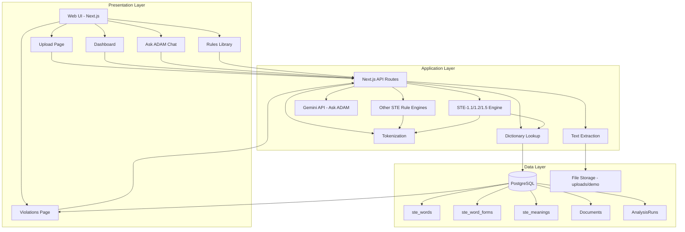
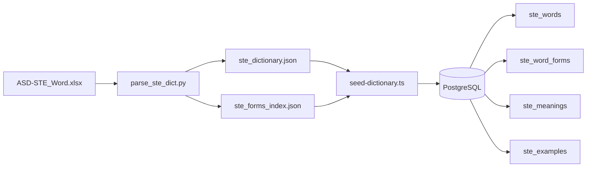
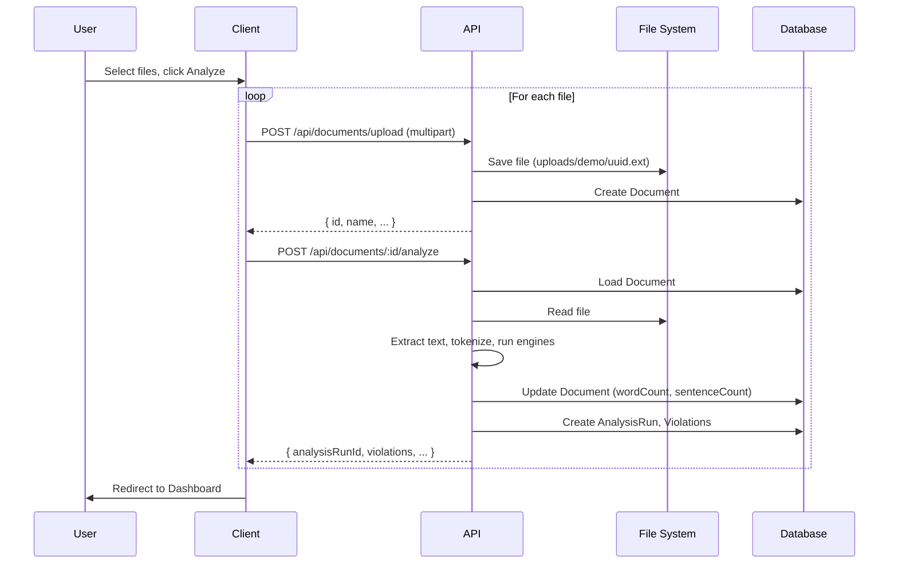
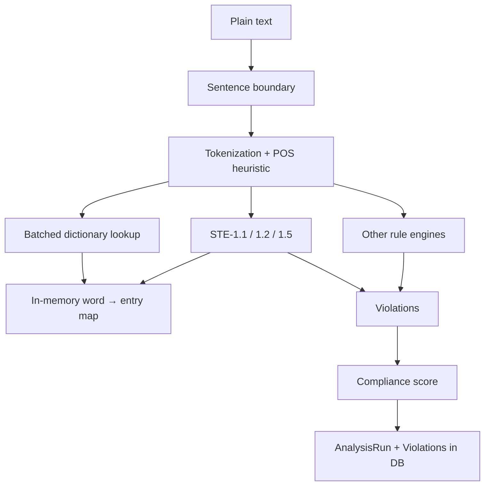

# ADAM Thesis — Chapters 3 & 4: System Design and Implementation

**Document:** thesisch3-4.md  
**Purpose:** Detailed narrative, algorithms, diagrams, and sketches for Chapters 3 (System Design) and 4 (Implementation) of the thesis, based on the current ADAM system and planned work.  
**References:** thesisplan.md, ruleplan.md, docs/ASD-STE_Word-xlsx-analysis.md, adam_dictionary_spec.md.

---

# Chapter 3 — System Design and Methodology

## 3.1 Introduction and Design Goals

The ADAM (Automated Document Analysis & Management) system is designed to check technical documentation against the *Simplified Technical English* (STE) standard, ASD-STE100, using the official *ASD-STE dictionary* (ASD-STE_Word.xlsx) as the sole source of approved and prohibited words. The primary design goals are:

1. **Strict dictionary-driven checking:** All word-level compliance (STE-1.1, STE-1.2, STE-1.5) is determined exclusively by the ASD-STE dictionary; no custom or external word lists are used for approval.
2. **End-to-end pipeline:** Users upload non-STE manuals (PDF, DOCX, TXT, MD); the system extracts text, runs rule engines, and presents violations with actionable suggestions.
3. **Scalability and performance:** Large documents (thousands of sentences) are supported via batched dictionary lookups to avoid N+1 database queries.
4. **Extensibility:** The architecture allows additional STE rules (beyond the word-level rules) to be added as separate engines, sharing the same tokenized document representation.
5. **Optional AI assistance:** An AI-powered “Ask ADAM” assistant uses the same STE context to answer questions and suggest rewrites, demonstrating how the dictionary supports both checking and generative help.

The system does *not* aim to implement all 60 STE rules in the first version; the thesis focuses on the dictionary foundation, STE-1.1/1.2/1.5, and a representative set of structural and punctuation rules (sentence length, passive voice, imperative, semicolons, serial comma, etc.) to show end-to-end applicability.

---

## 3.2 System Architecture

The system follows a three-tier architecture: **presentation (web UI)**, **application (API and analysis logic)**, and **data (database and file storage)**. The following diagram gives a high-level view.



**Component summary:**

| Layer        | Components | Responsibility |
|-------------|------------|----------------|
| Presentation | Next.js app (React), Upload, Dashboard, Violations, Ask ADAM, Rules | User interaction; display of documents, analysis results, violations, and chat. |
| Application  | API routes, text extraction, tokenization, dictionary lookup, STE rule engines, Gemini integration | Document processing, STE checking, persistence, and AI chat. |
| Data         | PostgreSQL (dictionary tables, Document, AnalysisRun, Violation), file system (uploaded files) | Persistent storage of dictionary, documents, and analysis results. |

---

## 3.3 Data Sources and Dictionary Pipeline

### 3.3.1 Source: ASD-STE_Word.xlsx

The only source of approved and prohibited words is the official **ASD-STE_Word.xlsx** spreadsheet (Word sheet). Its structure is as follows:

| Column | Header / meaning | Content |
|--------|------------------|--------|
| A | (empty) | Unused |
| B | Word (Part of Speech) | Headword + POS, e.g. `abandon (v)`, or conjugated forms `ABSORB (v), ABSORBS, ABSORBED`; empty on continuation rows |
| C | bApproved | `Yes` / `No` (approval flag); continuation rows may contain `#VALUE!` |
| D | Approved meaning | Meaning text or alternative word |
| E | ALTERNATIVES | Alternative word(s) with POS, e.g. `GO (v)`, `STOP (v)` |
| F | STE EXAMPLE | STE-compliant example sentence |
| G | Non-STE example | Non-compliant example |

**Continuation rows:** When column B is empty, the row continues the previous headword (additional meanings, alternatives, or example pairs). The approval flag (column C) is inherited from the last row with non-empty B.

**Verb forms:** Many cells in B list conjugations separated by commas (e.g. `ABSORB (v), ABSORBS, ABSORBED`). All such forms are indexed so that any form resolves to the same headword for lookup.

### 3.3.2 Dictionary Pipeline (XLSX → Database)

The pipeline from spreadsheet to queryable database has three stages:



1. **Parse (Python):** `parse_ste_dict.py` reads the Word sheet, handles continuation rows and verb conjugations, and outputs:
   - **ste_dictionary.json:** One entry per headword with `word`, `pos`, `approved`, `forms[]`, `meanings[]`, `alternatives[]`, `examples[]`.
   - **ste_forms_index.json:** Mapping from each surface form to headword (for fast form→headword resolution).
2. **Seed (Node/TypeScript):** `scripts/seed-dictionary.ts` loads the JSON, clears existing dictionary tables, and inserts into:
   - **ste_words:** id, word, word_display, pos, approved
   - **ste_word_forms:** id, word_id, form
   - **ste_meanings:** id, word_id, meaning, approved_as_is, alternative_word, alternative_pos
   - **ste_examples:** id, word_id, ste_text, non_ste_text
3. **Query:** The application uses Prisma to query these tables. Lookup resolves a *normalized token* (e.g. “utilized”) to a headword (e.g. “use”) via `ste_word_forms` or `ste_words`, then retrieves the full entry (approval, alternatives, examples, allowed forms) for the STE-1.1/1.2/1.5 engines.

### 3.3.3 Rule Definitions (ASD-STE100)

The 60 STE rules (STE-1.1 through STE-10.7) are defined by ASD-STE100 Issue 9. ADAM stores rule metadata (id, name, description, spec text, examples) in a `rules` table and in `data/ste-rules.json` for display and reference. Only a subset of rules have *checking logic* implemented; the rest are catalogued for user reference and future implementation.

---

## 3.4 Document Processing Pipeline

### 3.4.1 Upload and Storage

Users upload documents via the web UI. The flow is:

1. **Client:** User selects one or more files (PDF, DOCX, TXT, MD). On “Analyze,” the client sends each file to `POST /api/documents/upload` (multipart, field `file`).
2. **Server:** The upload API validates type and size (e.g. max 5 MB), saves the file under `uploads/demo/<uuid>.<ext>`, and creates a `Document` record with `name`, `filePath`, `mimeType`. No user or project is required for the thesis scope.
3. **Analysis trigger:** For each uploaded document, the client then calls `POST /api/documents/:id/analyze`. The analysis route loads the document, extracts text, runs all STE engines, and persists an `AnalysisRun` and `Violation` rows.



### 3.4.2 Text Extraction

Text extraction is format-dependent:

| Format | Method | Library / notes |
|--------|--------|-----------------|
| .docx | Extract raw text from Word XML | mammoth |
| .txt, .md | Read file as UTF-8 | Node fs |
| .pdf | Extract text from PDF binary | pdf-parse (pdfjs-dist); worker path set for Node.js |

The extractor returns plain text plus simple **word count** and **sentence count** (sentence split by period/newline and a sentence-boundary heuristic). This text is stored in memory for the analysis run and the counts are written back to the `Document` record.

---

## 3.5 Analysis Pipeline Design

### 3.5.1 Overview

The analysis pipeline takes the extracted text and produces a list of *violations* (each with rule ID, sentence excerpt, position, severity, and suggestion). It consists of:

1. **Sentence boundary detection** — Split text into sentences with character offsets.
2. **Tokenization** — Split each sentence into tokens (words and punctuation), normalize for dictionary lookup, and optionally assign a POS heuristic.
3. **Batched dictionary lookup** — Collect all unique word tokens in the document and resolve them to dictionary entries in a small number of batch queries (see §3.5.3).
4. **Rule engines** — Run each implemented STE rule over the tokenized document (and the preloaded dictionary map for STE-1.1/1.2/1.5). Merge violations.
5. **Scoring and persistence** — Compute a compliance score (e.g. 100 − 5×violations, capped at 0), create one `AnalysisRun` and many `Violation` rows.



### 3.5.2 Tokenization and Normalization

- **Sentence splitting:** The text is split into sentences using delimiters (e.g. `.`, `!`, `?`) and newlines, with offsets stored so that each violation can be tied to a character range in the original document.
- **Tokenization:** For each sentence, the implementation splits on whitespace and punctuation, producing tokens. Each token has:
  - **raw:** surface form as in the text
  - **normalized:** lowercase, stripped of leading/trailing punctuation, used for dictionary lookup
  - **isWord:** true if the token is treated as a word (e.g. not pure punctuation)
  - **posHeuristic:** optional part-of-speech hint (e.g. from suffix rules: -ed → verb, -ly → adverb) for comparison with dictionary POS
- **Skip rule:** Tokens that are purely numeric are skipped for STE-1.1 (no dictionary lookup). No other tokens are skipped; headings and titles are checked the same as body text.

### 3.5.3 Batched Dictionary Lookup (Performance Design)

For large documents, looking up every word token with a separate database query would cause tens of thousands of round-trips (e.g. 20,000+ for a 20k-word manual). The design therefore uses a **batched lookup**:

1. **Collect unique words:** From the tokenized document, collect all unique normalized word types that are eligible for lookup (isWord, not skip).
2. **Resolve form → word_id:** In batches (e.g. 2000 words per query), query `ste_word_forms` for `form IN (chunk)`. For words not found, query `ste_words` for `word IN (missing_chunk)` to resolve headwords.
3. **Load full entries:** For all resolved `word_id`s, run one or more batched `ste_words` queries with `include: { forms, meanings, examples }` to build full dictionary entries.
4. **Build map:** Construct an in-memory map `normalizedWord → DictionaryLookupResult`, including **`meanings[]`** (all `ste_meanings` rows per headword) for downstream STE-1.3 sense checking, not only collapsed `alternatives`.
5. **Engine use:** The STE-1.1/1.2/1.5 engine receives a *lookup function* that reads from this map (O(1) per token). No per-token database calls occur during the rule pass.

This reduces database usage to a small number of batch queries (on the order of tens) regardless of document size.

### 3.5.4 Dictionary meaning rows in the lookup result (STE-1.3 groundwork)

The type `DictionaryLookupResult` includes an optional **`meanings`** array: each element mirrors one row in **`ste_meanings`** (`meaning`, `approved_as_is`, `alternative_word`, `alternative_pos`). Both **`createBatchedPrismaLookup`** and **`createPrismaLookup`** populate this field whenever the headword has meaning rows. The STE-1.1 engine continues to use **`alternatives`** (derived from rows that specify an alternative) and does not yet run sense disambiguation; a future **STE-1.3** module will consume **`meanings`** together with sentence context.

### 3.5.5 Multi-meaning dictionary audit

A repeatable audit is provided as **`npm run audit:meanings`** (`scripts/audit-multi-meaning-words.ts`). It reports counts from **`nlp-service/data/ste_dictionary.json`** (approved headwords with more than one meaning row and/or any `approved_as_is: false`), writes **`data/reports/multi-meaning-json-summary.json`**, and writes a flattened CSV **`data/reports/multi-meaning-audit-from-json.csv`** (meaning-level rows; `word_id` blank). When **`DATABASE_URL`** is available and TLS succeeds, it also writes **`data/reports/multi-meaning-audit.csv`** including **`word_id`** from PostgreSQL. If the database connection fails (e.g. self-signed TLS), the JSON-side artifacts still succeed; use `$env:NODE_TLS_REJECT_UNAUTHORIZED='0'` for a one-off DB audit in development, as for other seed scripts.

### 3.5.6 STE-1.3 implementation strategy (decision)

Full word-sense disambiguation is out of scope for a strict dictionary-only checker. The adopted plan (see `missing-dic-driven.md` §5.1) is:

| Strategy | Role in ADAM |
|----------|----------------|
| **A. Pattern / keyword heuristics** | **Primary:** deterministic rules (e.g. collocations, regex) for high-value headwords such as *about*. |
| **B.–D.** | Optional extensions (examples-as-features, LLM assist, embeddings) — **future work**, not required for the first thesis milestone. |
| **E. Flag + review** | **Combined with A:** emit STE-1.3 violations only when a pattern matches with **high confidence**; otherwise no automatic violation (limitations stated in the thesis). |

This balances a **defensible** first implementation with honest **coverage limits** for polysemy.

---

## 3.6 STE Rule Engine Design

### 3.6.1 Word-Level Rules (STE-1.1, STE-1.2, STE-1.5)

These three rules are implemented in a single engine that consults the dictionary for each word token. The logic is:

**Algorithm: Word-level STE check (STE-1.1 / 1.2 / 1.5)**

```
Input:  TokenizedDocument doc, DictionaryLookup lookup
Output: List of violations (with ruleId, sentenceExcerpt, position, severity, suggestion)

for each sentence in doc.sentences:
  for each token in sentence.tokens:
    if not token.isWord or token.normalized is empty: continue
    if token.normalized is purely digits: continue   // skip numbers

    entry = lookup(token.normalized)

    if entry is null:
      emit violation(ruleId = "STE-1.1", reason = "unknown_word",
        suggestion = "Check spelling or add to custom word list if this is a domain term.")
      continue

    if not entry.approved:
      emit violation(ruleId = "STE-1.2", reason = "forbidden_word",
        suggestion = first alternative from entry.alternatives, e.g. "USE (v)")
      continue

    if dictionary has POS and token has posHeuristic and they differ:
      emit violation(ruleId = "STE-1.1", reason = "wrong_pos",
        suggestion = "Use \"HEADWORD\" as pos (dictionary), not as tokenPos.")
      continue

    if token.normalized not in entry.allowedForms:
      emit violation(ruleId = "STE-1.5", reason = "wrong_form",
        suggestion = list of allowed forms)
      continue

    // else: word approved, correct POS, correct form — no violation
```

**Data flow sketch (STE-1.1/1.2/1.5):**

```
Token "utilized"
    → normalized "utilized"
    → lookup("utilized") → entry (headword "use", approved=true, forms=[use, uses, using, used])
    → "utilized" not in allowedForms
    → STE-1.5 violation, suggestion: use "use", "uses", "using", "used"
```

```
Token "utilize"
    → lookup("utilize") → entry (headword "use", approved=false, alternatives=[USE (v)])
    → STE-1.2 violation, suggestion: "USE (v)"
```

### 3.6.1b STE-1.3 — Approved meanings (pattern layer)

A separate engine **`runSte13Check`** runs **after** the STE-1.1/1.2/1.5 pass on the same batched lookup. It considers only tokens that **would have passed** STE-1.1 (approved, POS and form consistent with the dictionary). For headwords configured in **`ste-meaning-patterns.ts`**, it applies **high-confidence regular expressions** on the **sentence text**; when a pattern matches, it ties the match to a **disallowed** meaning row (`approved_as_is: false`) via a `meaningIncludes` substring, and emits **`ruleId = STE-1.3`**, **`reason = wrong_meaning`**, with the dictionary alternative as the suggestion. This implements the **A + E** strategy in §3.5.6. Unit tests live in **`scripts/test-ste13-engine.ts`**; a manual **gold set** and metrics table for the thesis appendix are in **`docs/ste13-gold-set.md`**.

### 3.6.2 Other Implemented Rules (Summary)

| Rule | Purpose | Design (brief) |
|------|--------|-----------------|
| STE-8.1 | No semicolons | Scan each sentence for `;`; one violation per occurrence. |
| STE-5.1 / 5.2 | Sentence length | Classify sentence as instructional (verb-first) or descriptive; instructional >20 words or descriptive >25 words → violation. |
| STE-3.2 | Passive voice | Detect “be” + past participle; one violation per construction. |
| STE-4.1 | Imperative in procedures | If sentence contains should/must/shall but does not start with verb → violation (use imperative). |
| STE-7.1 | WARNING format | If sentence looks like a warning (starts with Warning/Caution/Danger) but not exactly “WARNING:” → violation. |
| STE-2.1 | Noun cluster length | Maximal run of tokens tagged as article/adjective/noun; length > 3 → violation. |
| STE-8.2 | Serial comma | “A, B and C” or “A, B or C” without comma before and/or → violation. |
| STE-8.3 | Compound numbers | Numbers 21–99 as words must be hyphenated (e.g. twenty-one). |
| STE-8.4 | No contractions | Tokens like don't, it's → violation; suggest full form. |
| STE-9.1 | Cross-references | “The section/figure/table” without a following number → vague reference violation. |
| STE-9.2 | Reference format | Reference label + number should be capitalized (e.g. Section 4). |
| STE-10.2 | Abbreviations | Latin abbreviations (e.g., i.e., etc.) → use full form. |
| STE-10.3, 10.4, 10.6 | Symbols, spelling, ellipsis | & and % → spell out; British→US spelling; ellipsis “...” usage. |

All of these operate on the same **tokenized document** (and optionally sentence-type or POS tags). They do not use the dictionary except for STE-1.x.

### 3.6.3 Violation Model and Compliance Score

Each violation is stored with:

- **analysisRunId**, **sentenceExcerpt**, **ruleId**, **ruleName**, **sentenceType**, **wordCount**, **severity** (critical/major/minor), **positionStart**, **positionEnd**, **aiSuggestion**, **paragraphContext**, **status** (pending/accepted/rejected).

The **compliance score** for a run is computed as:

```
score = max(0, min(100, 100 − totalViolations × penaltyPerViolation))
```

For example, with `penaltyPerViolation = 5`, 20 violations yield a score of 0. This score is stored on `AnalysisRun` and displayed on the dashboard.

---

## 3.7 Dashboard and Violations Data Model

- **Dashboard:** The dashboard shows the *latest analyzed document* (or a selected document): compliance score, violation counts by severity, top violated rules, document metadata (name, word count, sentence count), and recent activity. Data is fetched from `GET /api/dashboard/summary` (optional `documentId`; if omitted, the document of the most recent analysis run is used).
- **Violations list:** The violations page shows paginated violations for the same “latest” run (or a chosen document/run), with filters (rule, severity, sentence type, keyword). Data is from `GET /api/violations`. The API returns `documentId` and `documentName` so the UI can display “Showing: &lt;document name&gt;.”
- **Upload flow:** After upload and analyze, the client redirects to the dashboard; the dashboard and violations then reflect the newly analyzed document, ensuring the user sees up-to-date results.

---

## 3.8 Ask ADAM (AI Assistant) Integration Design

Ask ADAM is an optional extension that provides an AI-powered chat for STE-related questions and rewrites. The design is:

1. **API:** `POST /api/ask-adam` accepts a body `{ messages: [{ role, content }] }` (user/assistant/system). The route uses the **Google Gemini** API (via `@ai-sdk/google` and Vercel AI SDK’s `generateText`) with a fixed **system prompt** that describes ADAM as an STE writing assistant (rewrites, rule explanations, short answers, bold for terms and rule IDs). The API key is read from environment variables (`GOOGLE_GENERATIVE_AI_API_KEY` or `GEMINI_API_KEY`).
2. **Model:** e.g. `gemini-1.5-flash` for low latency and cost.
3. **Frontend:** The Ask ADAM page sends the current conversation history to the API and displays the returned `content` as the assistant reply. Errors (e.g. missing key, network) are shown in the UI.
4. **Thesis relevance:** The assistant does not directly query the dictionary in the current implementation; the system prompt instructs the model to follow STE rules and approved-word usage. Future work could inject dictionary excerpts (e.g. alternatives for prohibited words) into the context for more precise suggestions.

---

# Chapter 4 — Implementation and System Realization

## 4.1 Technology Stack

| Layer | Technology | Use |
|-------|------------|-----|
| Frontend | Next.js 16 (App Router), React 19, Tailwind CSS | Pages, components, routing |
| API | Next.js Route Handlers (App Router) | REST endpoints for upload, analyze, dashboard, violations, rules, ask-adam |
| Database | PostgreSQL (e.g. Supabase), Prisma ORM | Dictionary tables, Document, AnalysisRun, Violation, Rules |
| Text extraction | mammoth (DOCX), Node fs (TXT/MD), pdf-parse (PDF) | Plain text from uploaded files |
| Analysis | TypeScript modules in `app/lib/analysis/` | Tokenization, sentence boundary, POS heuristic, all STE rule engines |
| Dictionary seed | Node/TS (tsx), Prisma | Load JSON into DB |
| Dictionary source | Python (parse_ste_dict.py), pandas/openpyxl | XLSX → JSON |
| AI (Ask ADAM) | @ai-sdk/google, Vercel AI SDK (generateText) | Gemini for chat |

---

## 4.2 Dictionary Implementation

### 4.2.1 Schema (Prisma)

Relevant models (simplified):

```
model SteWord {
  id, word, wordDisplay, pos, approved
  forms    SteWordForm[]
  meanings SteMeaning[]
  examples SteExample[]
}

model SteWordForm {
  id, wordId, form
  word SteWord
  @@index([form])
}

model SteMeaning {
  id, wordId, meaning, approvedAsIs, alternativeWord, alternativePos
}

model SteExample {
  id, wordId, steText, nonSteText
}
```

### 4.2.2 Batched Lookup Algorithm (Pseudocode)

The batched lookup is implemented in `createBatchedPrismaLookup(prisma, tokenizedDocument)`:

```
Algorithm: CreateBatchedPrismaLookup(doc, prisma)

1. uniqueWords = set of normalized word tokens from doc (isWord, not digits)
2. wordToId = empty map (string → word_id)

3. For each chunk of uniqueWords (e.g. BATCH_SIZE = 2000):
   - rows = prisma.steWordForm.findMany({ where: { form: { in: chunk } }, select: { form, wordId } })
   - For each row: wordToId[row.form] = row.wordId

4. missing = words in uniqueWords not in wordToId
5. For each chunk of missing:
   - rows = prisma.steWord.findMany({ where: { word: { in: chunk } }, select: { id, word } })
   - For each row: wordToId[row.word] = row.id

6. wordIds = unique values in wordToId
7. entriesById = empty map (word_id → DictionaryLookupResult)
8. For each chunk of wordIds:
   - entries = prisma.steWord.findMany({ where: { id: { in: chunk } }, include: { forms, meanings, examples } })
   - For each e in entries: entriesById[e.id] = toLookupResult(e)   // approved, alternatives, allowedForms, etc.

9. resultMap = empty map (string → DictionaryLookupResult)
10. For each w in uniqueWords:
    - id = wordToId[w]
    - if id and entriesById[id]: resultMap[w] = entriesById[id]

11. Return lookup function: (word) => Promise.resolve(resultMap.get(normalize(word)) ?? null)
```

This ensures that the STE-1.1/1.2/1.5 engine performs no database calls during the document pass.

---

## 4.3 Text Extraction Implementation

- **DOCX:** Buffer read from disk → `mammoth.extractRawText({ buffer })` → raw text string.
- **TXT/MD:** File read as UTF-8 → `buffer.toString("utf-8")`.
- **PDF:** File read as buffer → `PDFParse` (pdf-parse) with `{ data: Uint8Array(buffer) }`; worker path set to `node_modules/pdfjs-dist/legacy/build/pdf.worker.mjs` for Node.js. Call `getText()` → concatenated text; then `destroy()`.

Word and sentence counts are computed from the extracted text (sentence split by the same logic used in the analysis pipeline) and stored on the `Document` record.

---

## 4.4 Tokenization and POS Heuristic

- **Sentence boundary:** Sentences are split using delimiters and offsets are recorded (`offsetInDocument`, `offsetInSentence`) for each sentence and token.
- **Tokens:** Each sentence is split into tokens; each token has `raw`, `normalized` (lowercase, punctuation stripped for lookup), `isWord` (true for alphabetic or alphanumeric tokens), and optionally `posHeuristic`.
- **POS heuristic:** Implemented in `pos-heuristic.ts`: suffix rules (e.g. -ed, -ing, -ly), common imperative verbs (open, close, check, set, …), and a default “unknown” so that only tokens with a confident tag are compared to dictionary POS. This avoids claiming full linguistic accuracy while still supporting wrong-POS detection when the heuristic and dictionary agree.

---

## 4.5 Rule Engines Implementation

Each rule is implemented as a function that takes the **tokenized document** (and, for STE-1.1/1.2/1.5, the batched lookup) and returns a list of violations. The analyze route calls them in sequence and merges all violations. Example call order:

```
tokenized = tokenizeText(text, { applyPosHeuristic: true })
lookup = await createBatchedPrismaLookup(prisma, tokenized)
ste11Result = await runSte11Check(tokenized, lookup)
ste81Result = runSte81Check(tokenized)
ste5Result = runSte5Check(tokenized)
ste32Result = runSte32Check(tokenized)
... (remaining engines)
allViolations = [ ...ste11Result.violations, ...ste81Result.violations, ... ]
```

Violations are then mapped to the database schema (analysisRunId, sentenceExcerpt, ruleId, ruleName, severity, positionStart/End, aiSuggestion, status) and persisted via `prisma.violation.createMany`.

---

## 4.6 API Design and Routes

| Method | Route | Purpose |
|--------|-------|--------|
| POST | /api/documents/upload | Upload file; create Document; return id, name, etc. |
| POST | /api/documents/:id/analyze | Extract text, run all STE engines, create AnalysisRun and Violations |
| GET | /api/documents/:id | Document metadata |
| GET | /api/documents/:id/text | Extracted text |
| GET | /api/dashboard/summary | Summary for latest or given document (score, counts, top rules, metadata) |
| GET | /api/violations | Paginated violations (latest run or by documentId/analysisRunId); filters; returns documentName |
| PATCH | /api/violations/:id | Update violation status (accepted/rejected) |
| GET | /api/rules | List rules; GET /api/rules/:id for detail |
| POST | /api/analysis/check | Stateless check: body `{ text }` → violations and score (for testing) |
| POST | /api/ask-adam | Chat: body `{ messages }` → Gemini response `{ content }` |

---

## 4.7 Frontend Integration

- **Upload:** The upload page sends each selected file to `/api/documents/upload`, then for each returned document id calls `/api/documents/:id/analyze`. On success, it redirects to the dashboard. Supported types: .docx, .txt, .md, .pdf. Errors (e.g. unsupported type, analysis failure) are shown in the UI.
- **Dashboard:** Fetches `/api/dashboard/summary` on load; displays compliance score, violation counts, document metadata, and charts (e.g. top violated rules, sentence-type breakdown). Shows “Live data” when a document is present, “No document” otherwise.
- **Violations:** Fetches `/api/violations` with pagination and filters; displays a table with sentence excerpt, rule ID, severity, status, AI suggestion, and actions (accept/reject/edit). Displays “Showing: &lt;document name&gt;” when the API returns document metadata.
- **Ask ADAM:** Sends the current message list to `/api/ask-adam` and appends the returned `content` as the assistant message. Shows “Gemini” badge and displays API errors (e.g. missing key) in the UI.

---

## 4.8 Evaluation and Testing Approach

- **Unit tests:** Each STE rule engine has a dedicated test script (e.g. `scripts/test-ste11-engine.ts`) that runs the engine on hand-crafted sentences and asserts expected violations. A single command `npm run test:ste-rules` runs all STE rule tests.
- **Integration:** The analysis API and document pipeline can be tested by uploading a test file and asserting on the returned violations and score.
- **Manual evaluation:** For the thesis, a small set of sentences (or a sample manual) can be analyzed and the violations reviewed manually to argue correctness of the dictionary-driven behavior and of the structural rules (e.g. passive, imperative, length).
- **Logging:** The analyze route and dictionary batch step log progress (e.g. “Extracting text,” “Batched dictionary: N unique words,” “STE-1.1 running,” “Done: run id”) so that behavior can be traced and verified during development and demos.

---

## Diagrams and Sketches Summary

1. **Figure 3.1 — System architecture:** Three-tier (Presentation, Application, Data) with main components and data flow (Mermaid flowchart).
2. **Figure 3.2 — Dictionary pipeline:** XLSX → Parser → JSON → Seed → PostgreSQL (Mermaid flowchart).
3. **Figure 3.3 — Upload and analyze sequence:** User, Client, API, FS, DB (Mermaid sequence diagram).
4. **Figure 3.4 — Analysis pipeline:** Text → Sentence boundary → Tokenization → Batched lookup → Rule engines → Violations → Persist (Mermaid flowchart).
5. **Algorithm 3.1 — Word-level STE check:** Pseudocode for STE-1.1/1.2/1.5 (inline in §3.6.1).
6. **Algorithm 4.1 — Batched dictionary lookup:** Pseudocode for CreateBatchedPrismaLookup (inline in §4.2.2).
7. **Table 3.1 — ASD-STE_Word.xlsx columns;** **Table 3.2 — Implemented STE rules;** **Table 4.1 — Technology stack;** **Table 4.2 — API routes:** All provided in the text above.

These sections and figures can be copied into the thesis and expanded with institution-specific formatting (e.g. “Algorithm” and “Figure” captions) and references to prior chapters (e.g. Chapter 2 — Literature/STE background) as needed.
